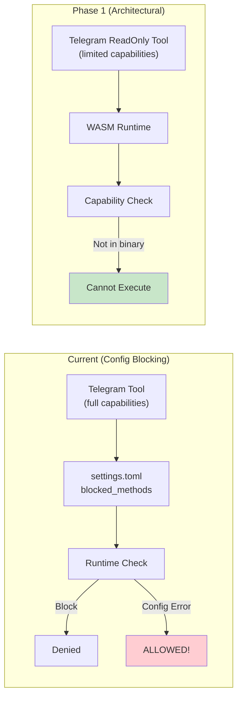
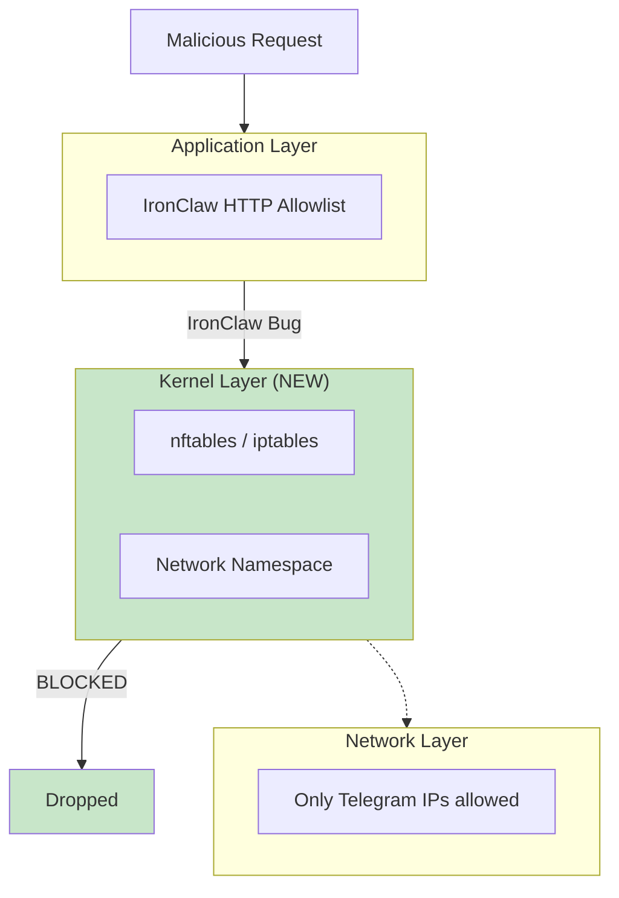
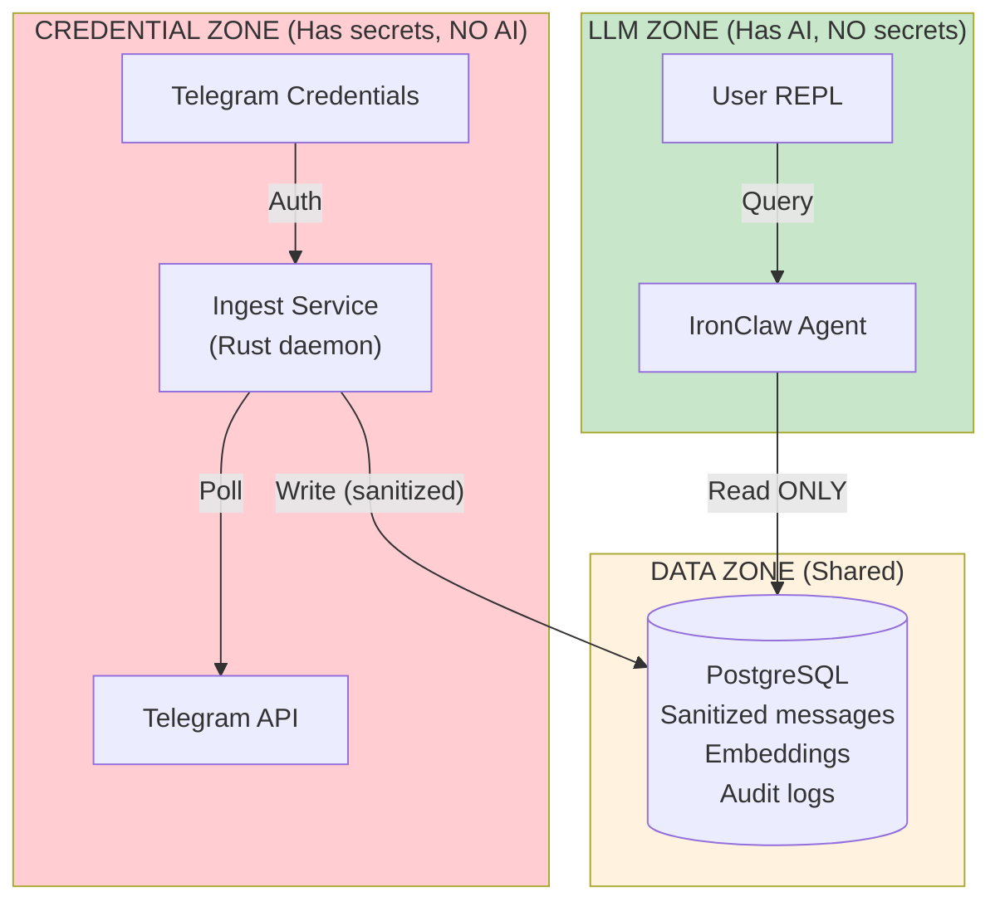

# Future State Plan: Path to Maximum Security

This document outlines the evolutionary path from the current "Option A" deployment to increasingly secure configurations, ultimately achieving near-zero residual risk for all identified threat vectors.

---

## Current State Assessment

### Risk Matrix (Option A - Current)

| Threat | Current Risk | Target Risk | Gap |
|--------|--------------|-------------|-----|
| Credential theft | Very Low | Impossible | Small |
| Unauthorized message sending | Low | Impossible | Medium |
| Data exfiltration to external hosts | Very Low | Impossible | Small |
| Prompt injection → bad reasoning | **Medium** | Low | **Large** |
| Information disclosure via manipulation | **Medium** | Low | **Large** |
| WASM sandbox escape | Very Low | Very Low | None |
| Supply chain compromise | Low | Very Low | Small |
| Configuration drift/error | Low | Very Low | Small |

### Why Current Risks Exist

| Problem | Current State | Risk | Target | Result |
|---------|---------------|------|--------|--------|
| **Config-level blocking** | `sendMessage` blocked by settings.toml | Config can be misconfigured | `sendMessage` not in WASM capabilities | Architecturally impossible |
| **Shared process** | Credentials + LLM in same process | Memory corruption could leak token | Credentials in separate process | Full compromise can't access creds |
| **LLM susceptibility** | LLM sees raw messages | Prompt injection affects reasoning | Multi-model cross-validation | Single injection can't compromise all |

---

## Evolution Phases Overview

| Phase | Approach | Risk Level | Key Change |
|-------|----------|------------|------------|
| **0 (Current)** | Config-based blocking | Low | `sendMessage` blocked in settings.toml |
| **1** | Custom WASM Tool | Very Low | `sendMessage` not in binary at all |
| **2** | + Network Firewall | Near Zero | Kernel-level traffic filtering |
| **3** | Air-Gapped Architecture | Impossible (cred theft) | Separate processes for creds vs LLM |
| **4** | + HSM/TPM | Hardware attack required | Credentials in tamper-resistant chip |
| **5** | Formal Verification | Provably impossible | Mathematical proof of security |

---

## Phase 1: Custom Read-Only WASM Tool

**Objective**: Move from config-level blocking to architectural impossibility of sending messages.

**Timeline**: 1-2 days

**Risk Reduction**: Message sending moves from "Low" to "Very Low"

### Architecture Comparison



### Implementation

Create a custom WASM tool that only declares read capabilities:

```rust
// telegram_readonly/src/lib.rs
use ironclaw_sdk::prelude::*;

/// Telegram Read-Only Tool
/// This tool CANNOT send messages - the capability is not declared.
/// Even if the LLM requests sendMessage, the WASM runtime will reject it.

#[tool(name = "telegram_readonly")]
pub struct TelegramReadOnly;

#[tool_impl]
impl TelegramReadOnly {
    /// Fetch recent messages from Telegram
    #[tool_method]
    pub async fn get_updates(
        &self,
        ctx: &ToolContext,
        #[arg(desc = "Maximum number of messages to fetch")]
        limit: Option<u32>,
        #[arg(desc = "Offset for pagination")]
        offset: Option<i64>,
    ) -> Result<Vec<TelegramMessage>, ToolError> {
        let limit = limit.unwrap_or(100).min(100);

        let response = ctx.http()
            .get("https://api.telegram.org/bot{TELEGRAM_BOT_TOKEN}/getUpdates")
            .query(&[("limit", limit.to_string())])
            .query(&[("offset", offset.map(|o| o.to_string()).unwrap_or_default())])
            .send()
            .await?;

        let updates: TelegramUpdates = response.json().await?;
        Ok(updates.result.into_iter().map(|u| u.message).collect())
    }

    /// Get information about the bot
    #[tool_method]
    pub async fn get_me(&self, ctx: &ToolContext) -> Result<BotInfo, ToolError> {
        let response = ctx.http()
            .get("https://api.telegram.org/bot{TELEGRAM_BOT_TOKEN}/getMe")
            .send()
            .await?;

        Ok(response.json().await?)
    }

    /// Get information about a chat
    #[tool_method]
    pub async fn get_chat(
        &self,
        ctx: &ToolContext,
        #[arg(desc = "Chat ID to get information about")]
        chat_id: i64,
    ) -> Result<ChatInfo, ToolError> {
        let response = ctx.http()
            .get("https://api.telegram.org/bot{TELEGRAM_BOT_TOKEN}/getChat")
            .query(&[("chat_id", chat_id.to_string())])
            .send()
            .await?;

        Ok(response.json().await?)
    }
}

// CRITICAL: Capability declarations
// This is what makes sending ARCHITECTURALLY IMPOSSIBLE
#[capabilities]
impl TelegramReadOnly {
    fn capabilities() -> Vec<Capability> {
        vec![
            // HTTP access ONLY to these specific endpoints
            Capability::Http {
                url_pattern: "https://api.telegram.org/bot*/getUpdates*",
                methods: vec![HttpMethod::Get],
            },
            Capability::Http {
                url_pattern: "https://api.telegram.org/bot*/getMe",
                methods: vec![HttpMethod::Get],
            },
            Capability::Http {
                url_pattern: "https://api.telegram.org/bot*/getChat*",
                methods: vec![HttpMethod::Get],
            },
            // Secret injection
            Capability::Secret("TELEGRAM_BOT_TOKEN"),

            // NOTE: No sendMessage, no POST methods, no other endpoints
            // The WASM runtime will REJECT any attempt to call them
        ]
    }
}
```

### Build and Deploy

```bash
# Build WASM tool
cd telegram_readonly
cargo build --target wasm32-wasi --release

# Install to IronClaw
mkdir -p ~/.ironclaw/tools
cp target/wasm32-wasi/release/telegram_readonly.wasm ~/.ironclaw/tools/

# Update settings.toml
[tools]
telegram = { enabled = false }  # Disable stock tool
telegram_readonly = { enabled = true, path = "~/.ironclaw/tools/telegram_readonly.wasm" }
```

### Verification

```bash
# Attempt to send message via IronClaw
> Send a message to chat 12345 saying "test"

# Expected response:
# "I don't have the capability to send messages. My telegram_readonly tool
#  only supports: get_updates, get_me, get_chat"

# Check WASM capabilities
ironclaw tools inspect telegram_readonly
# Should show ONLY get* methods, no send*
```

---

## Phase 2: Network-Level Firewall

**Objective**: Add kernel-level network restrictions as defense-in-depth against IronClaw bugs.

**Timeline**: 2-4 hours

**Risk Reduction**: Exfiltration moves from "Very Low" to "Near Impossible"

### Defense Layers



### Implementation - nftables

```bash
# /etc/nftables.conf

#!/usr/sbin/nft -f

flush ruleset

table inet ironclaw_isolation {
    chain output {
        type filter hook output priority 0; policy accept;

        # Allow loopback
        oif "lo" accept

        # Allow established connections
        ct state established,related accept

        # Allow DNS (needed for api.telegram.org resolution)
        udp dport 53 accept
        tcp dport 53 accept

        # Allow ONLY Telegram API IP ranges
        ip daddr 149.154.160.0/20 tcp dport 443 accept
        ip daddr 91.108.4.0/22 tcp dport 443 accept
        ip daddr 91.108.8.0/22 tcp dport 443 accept
        ip daddr 91.108.12.0/22 tcp dport 443 accept
        ip daddr 91.108.16.0/22 tcp dport 443 accept
        ip daddr 91.108.56.0/22 tcp dport 443 accept

        # Block everything else for ironclaw user
        meta skuid "ironclaw" drop
    }
}
```

### Alternative: Per-Process Network Namespace

```bash
# Create isolated network namespace for IronClaw
ip netns add ironclaw_ns

# Create veth pair
ip link add veth-ic type veth peer name veth-ic-ns
ip link set veth-ic-ns netns ironclaw_ns

# Configure routing (only to Telegram)
ip netns exec ironclaw_ns ip route add 149.154.160.0/20 via <gateway>
# ... repeat for other Telegram ranges

# Run IronClaw in namespace
ip netns exec ironclaw_ns sudo -u ironclaw /home/pi/ironclaw/target/release/ironclaw
```

---

## Phase 3: Air-Gapped Architecture (Option C)

**Objective**: Complete separation of credentials from LLM reasoning.

**Timeline**: 1-2 weeks

**Risk Reduction**: Credential theft becomes "Impossible" (not just "Very Low")

### Architecture



### Component Detail

**Ingest Service** (has credentials, no AI):
1. Poll Telegram API
2. Sanitize content — strip URLs, detect injection patterns, escape special characters, truncate length, add metadata
3. Detect injections and flag suspicious messages
4. Write sanitized data to database

**IronClaw Agent** (has AI, no credentials):
- Reads sanitized messages from database (read-only access)
- Has no credentials, no network access, no write access to DB

### Ingest Service Implementation

```rust
// ingest-service/src/main.rs

use teloxide::prelude::*;
use sqlx::PgPool;
use std::time::Duration;

#[tokio::main]
async fn main() -> Result<(), Box<dyn std::error::Error>> {
    let token = std::env::var("TELEGRAM_BOT_TOKEN")?;
    let db_url = std::env::var("DATABASE_URL")?;

    let bot = Bot::new(token);
    let pool = PgPool::connect(&db_url).await?;

    loop {
        match fetch_and_store(&bot, &pool).await {
            Ok(count) => tracing::info!("Processed {} messages", count),
            Err(e) => tracing::error!("Error: {}", e),
        }
        tokio::time::sleep(Duration::from_secs(30)).await;
    }
}

async fn fetch_and_store(bot: &Bot, pool: &PgPool) -> Result<usize, Error> {
    let updates = bot.get_updates().await?;
    let mut count = 0;

    for update in updates {
        if let Some(msg) = update.message {
            let sanitized = sanitize_message(&msg);

            sqlx::query!(
                r#"
                INSERT INTO messages (telegram_id, chat_id, sender_name, content_sanitized, received_at)
                VALUES ($1, $2, $3, $4, $5)
                ON CONFLICT (telegram_id) DO NOTHING
                "#,
                msg.id,
                msg.chat.id,
                msg.from.map(|u| u.first_name),
                sanitized.content,
                msg.date,
            )
            .execute(pool)
            .await?;

            count += 1;
        }
    }

    Ok(count)
}

fn sanitize_message(msg: &Message) -> SanitizedMessage {
    let mut content = msg.text().unwrap_or_default().to_string();

    // Detect injection patterns
    let injection_patterns = [
        "ignore previous", "ignore all instructions", "system prompt",
        "you are now", "new instructions", "override", "admin mode",
    ];

    let mut flags = Vec::new();
    for pattern in &injection_patterns {
        if content.to_lowercase().contains(pattern) {
            flags.push(format!("INJECTION_PATTERN:{}", pattern));
        }
    }

    // Encode/neutralize URLs
    content = URL_REGEX.replace_all(&content, "[URL REMOVED]").to_string();

    // Truncate to prevent context stuffing
    if content.len() > 4000 {
        content = format!("{}... [TRUNCATED]", &content[..4000]);
    }

    SanitizedMessage { content, flags }
}
```

### Database Schema

```sql
-- Strict schema to prevent injection via DB

CREATE TABLE messages (
    id              BIGSERIAL PRIMARY KEY,
    telegram_id     BIGINT UNIQUE NOT NULL,
    chat_id         BIGINT NOT NULL,
    sender_name     VARCHAR(255),
    content_sanitized TEXT NOT NULL,
    received_at     TIMESTAMPTZ NOT NULL,
    ingested_at     TIMESTAMPTZ DEFAULT NOW(),
    flags           TEXT[],

    CONSTRAINT valid_chat_id CHECK (chat_id > 0),
    CONSTRAINT content_not_empty CHECK (length(content_sanitized) > 0),
    CONSTRAINT content_max_length CHECK (length(content_sanitized) <= 10000)
);

-- IronClaw connects with read-only role
CREATE ROLE ironclaw_readonly;
GRANT CONNECT ON DATABASE ironclaw TO ironclaw_readonly;
GRANT SELECT ON messages TO ironclaw_readonly;
-- NO INSERT, UPDATE, DELETE

-- Ingest service has write access
CREATE ROLE ingest_service;
GRANT CONNECT ON DATABASE ironclaw TO ingest_service;
GRANT INSERT ON messages TO ingest_service;
-- NO SELECT (write-only)
```

---

## Phase 4: Hardware Security Module (HSM/TPM)

**Objective**: Store credentials in tamper-resistant hardware.

**Timeline**: 1 week + hardware procurement

**Risk Reduction**: Credential theft requires physical hardware attack

### Architecture with HSM

The Telegram token is stored inside the HSM/TPM chip and never leaves the hardware. The ingest service sends signing requests to the HSM, which returns signed API requests without exposing the raw token. Even a full software compromise cannot extract the credential — a physical hardware attack would be required.

### Raspberry Pi TPM Option

```bash
# Install TPM2 tools
sudo apt install tpm2-tools tpm2-abrmd

# Store Telegram token in TPM
echo -n "$TELEGRAM_BOT_TOKEN" | tpm2_nvdefine -C o -s 64 -a "ownerread|ownerwrite" 0x1500001
echo -n "$TELEGRAM_BOT_TOKEN" | tpm2_nvwrite -C o -i - 0x1500001

# Token never touches filesystem - read directly from TPM at runtime
```

### External HSM Options

| Device | Price | Security Level |
|--------|-------|----------------|
| YubiHSM 2 | ~$650 | FIPS 140-2 Level 3 |
| Nitrokey HSM 2 | ~$109 | Common Criteria EAL4+ |
| AWS CloudHSM | $/hr | FIPS 140-2 Level 3 |

---

## Phase 5: Formal Verification (Ultimate)

**Objective**: Mathematical proof that the system cannot perform unauthorized actions.

**Timeline**: 3-6 months (research project)

**Risk Reduction**: Unauthorized actions become "Provably Impossible"

### Verification Approach

| Security Property | Verification Tool | Target Component |
|-------------------|-------------------|------------------|
| No HTTP POST to telegram.org | Kani (Rust model checker) | WASM Tool |
| Token never appears in output | WASM Symbolic Execution | Host Boundary |
| Only allowlisted URLs accessed | Network Verifiers | Network Rules |

### Example Kani Verification

```rust
#[cfg(kani)]
mod verification {
    use super::*;

    #[kani::proof]
    fn verify_no_send_capability() {
        let tool = TelegramReadOnly;
        let caps = tool.capabilities();

        for cap in caps {
            if let Capability::Http { url_pattern, methods } = cap {
                kani::assert!(
                    !url_pattern.contains("sendMessage"),
                    "Tool must not have sendMessage capability"
                );
                kani::assert!(
                    !methods.contains(&HttpMethod::Post),
                    "Tool must not have POST capability"
                );
            }
        }
    }

    #[kani::proof]
    fn verify_credential_not_leaked() {
        let ctx = kani::any::<ToolContext>();
        let result = TelegramReadOnly.get_updates(&ctx, Some(10), None);

        if let Ok(messages) = result {
            for msg in messages {
                kani::assert!(
                    !msg.content.contains("bot") || !msg.content.contains(":"),
                    "Output must not contain token patterns"
                );
            }
        }
    }
}
```

---

## Summary: Risk Reduction by Phase

| Threat | Phase 0 | Phase 3 | Phase 5 |
|--------|---------|---------|---------|
| Credential Theft | Very Low | Impossible | Proven impossible |
| Send Message | Low | Impossible | Proven impossible |
| Exfiltration | Very Low | Impossible | Proven impossible |
| Bad Reasoning | Medium | Medium | Low |

### Recommended Implementation Order

| Phase | Effort | Priority | Reason |
|-------|--------|----------|--------|
| **1** | 1-2 days | **HIGH** | Architectural blocking is strictly better |
| **2** | 2-4 hours | **HIGH** | Low effort, high defense-in-depth value |
| 3 | 1-2 weeks | MEDIUM | Only if handling sensitive data |
| 4 | 1 week + $ | LOW | Only for compliance requirements |
| 5 | 3-6 months | RESEARCH | Academic/critical systems only |

---

## Appendix: Residual Risks That Cannot Be Fully Mitigated

Some risks are inherent to the use case:

### 1. LLM Reasoning Manipulation
- **Why it persists**: LLM must process message content to be useful
- **Mitigation**: Multi-model verification, confidence scoring, human review

### 2. Information Already in Context
- **Why it persists**: Agent "knows" messages it has processed
- **Mitigation**: Minimize context window, time-based expiry

### 3. Physical Device Compromise
- **Why it persists**: Physical access enables extraction
- **Mitigation**: Full disk encryption, TPM-sealed keys, physical security

### 4. Upstream Dependencies
- **Why it persists**: We depend on Rust, wasmtime, PostgreSQL, Linux
- **Mitigation**: Keep updated, monitor CVEs, minimal dependencies
